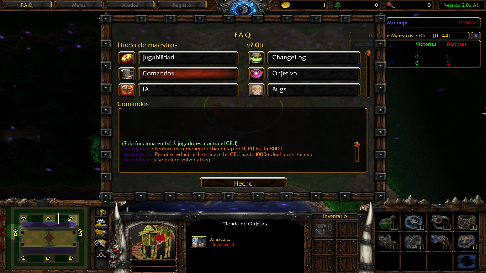

# Warcraft III - Duelo de maestros


Este repositorio contiene las versiones desprotegidas de un proyecto de mapping realizado con la herramienta World Editor que empecé hace algunos años.

Personalmente, aprender a usar esta herramienta fue lo que me acercó al mundo de la programación. Dado que no actualizo mas este mapa, pense en dejar la versión editable pública.


## Disclaimer

Dado que esto fue creciendo cuando recién empezaba a entender programación, es probable encontrar triggers que incluso con las limitaciones que tiene el editor podrían modularizarse mejor para evitar algunas repeticiones.

Hoy en día para editar hay herramientas mas avanzandas que el editor original como [Wurst](https://wurstlang.org/).

## Uso

El repositorio contiene las versiones principales del mapa totalmente desprotegidas, por lo que pueden cargarse dentro de Warcraft III sin problemas. Dicho esto, recomiendo descargar la versión protegida y optimizada con la herramienta de Vexorian (*la cual esta incluída en este repositorio*) desde EpicWar haciendo click en este [LINK](https://www.epicwar.com/maps/294148/). 

**El mapa fue probado en las versiones 1.26 y 1.27. No puedo garantizar su funcionamiento en versiones previas o Post 1.29.**

El mapa desprotegido puede servir para alguien intentando aprender a usar el editor de mundos de Warcraft III. El mapa contiene entre varios sistemas lo siguiente...

```
* Sistema de selección de heroés en taverna
* Sistema de compra de habilidades u objetos
* Manejo de regiones
* Validación de cantidad de jugadores
* Comandos para alterar el juego
* Uso de mensajes con colores hexadecimales
* 6 slots para jugadores o IA
* Multiboard (Tabla de posiciones)
* Sistema Queue para alternar entre jugadores
* F.A.Q. detallado
* Timers para las diferentes etapas del juego
    - Compra
    - Pelea
    - Cambio de jugadores
* Habilidades custom. Incluyendo triggers, dummy units
* Triggers para debugging que se pueden habilitar
* Uso de preload para precargar recursos al inicio
* Manejo de Arrays para control de jugadores, habilidades u objetos
* Textos flotantes para ciertas ocasiones
* IA para cada heroé (Triggers que se activan/desactivan)
* IA para uso de habilidades/objetos por heroés manejados por IA
* Control de Memory Leaks
```

## Imagenes

### F.A.Q



### Descripciones y mensajes  a color


### Ejemplo de trigger para habilidad custom con uso de Dummy unit


### Ejemplo de trigger para definir mensaje a color


### Ejemplo de trigger para la IA de un heroé


